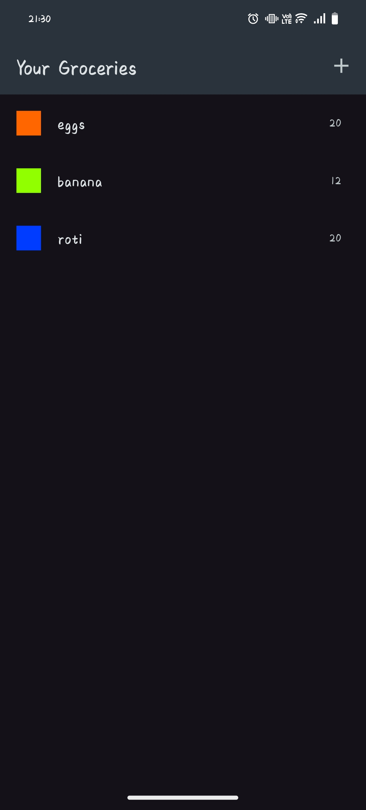
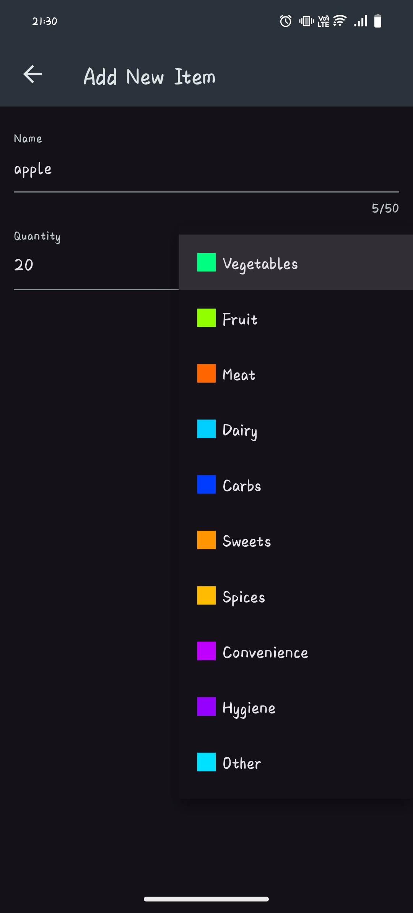

# 🛒 Shopping App

A sophisticated Flutter grocery list application with Firebase backend integration, form validation, and real-time data management. Keep track of your shopping items with categories, quantities, and seamless cloud synchronization.

## 📸 Screenshots

<div align="center">
  
| | | |
|:-------------------------:|:-------------------------:|:-------------------------:|
|  **Groceries List** |  **Add New Item** | |

</div>

## ✨ Features

- 🛍️ **Grocery List Management** - Add, view, and manage shopping items
- 🔢 **Quantity Tracking** - Track item quantities with easy updates
- 🏷️ **Smart Categorization** - Organize items by categories (Vegetables, Fruits, Dairy, etc.)
- ☁️ **Firebase Integration** - Real-time cloud synchronization using REST APIs
- ✅ **Form Validation** - Robust input validation with character limits
- 📱 **FutureBuilder Implementation** - Efficient async data handling
- 🗑️ **Item Deletion** - Remove items with HTTP DELETE requests
- 📊 **Empty State Handling** - Graceful handling of no-data scenarios

## 🛠️ Technical Implementation

### Advanced Concepts Mastered:
- **Firebase REST API Integration** - HTTP POST, GET, DELETE requests
- **Form Validation Logic** - Comprehensive input validation with Form widget
- **FutureBuilder Widget** - Efficient async data loading and state management
- **Error Handling** - Network error and empty state management
- **State Management** - Reactive UI updates based on backend data
- **Data Modeling** - Structured grocery item models with categories

## 🚀 Getting Started

### Prerequisites

- Flutter SDK (3.0 or higher)
- Dart (2.17 or higher)
- Firebase Project with Realtime Database

### Installation

1. **Clone the repository**
   ```bash
   git clone https://github.com/Official-Dinesh-Raut/shopping_app.git
   cd shopping_app
